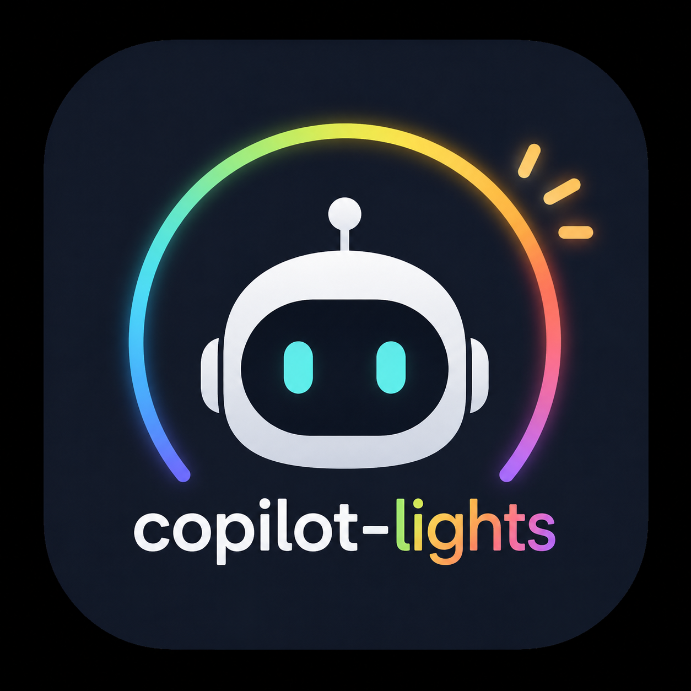

<p align="center">
  
</p>

# copilot-lights

> Ambient smart-light status for the GitHub Copilot CLI. Your lights gently
> shift color when Copilot is **ready**, **thinking**, **awaiting your reply**,
> or hit an **error** — so you can glance up from your other monitor (or your
> coffee) and know what's going on.

Drives **Home Assistant** (primary) and **Philips Hue** (direct local bridge).
Other adapters slot in behind one `LightAdapter` interface. On macOS you also
get a menu-bar widget that mirrors the same state, and an optional floating
desktop orb.

- [Quick start](#quick-start)
- [Install](#install)
  - [One-line installer](#one-line-installer-macos--linux)
  - [Just the macOS menu-bar app](#just-the-macos-menu-bar-app)
  - [Manual install from a checkout](#manual-install-from-a-checkout)
  - [Optional autostart](#optional-autostart)
  - [Hue first-run pairing](#hue-first-run-pairing)
- [Configure](#configure)
- [CLI](#cli)
- [What surfaces are supported?](#what-surfaces-are-supported)
- [macOS menu-bar app + Settings UI](#macos-menu-bar-app--settings-ui)
- [Troubleshooting](#troubleshooting)
- [Uninstall](#uninstall)
- [Develop](#develop)

## Quick start

```bash
# 1. Install daemon + CLI + (on macOS) menubar app
curl -fsSL https://raw.githubusercontent.com/BensBar/copilot-lights/main/install.sh | bash

# 2. Configure your lights
$EDITOR ~/.copilot-lights/config.json

# 3. Sanity check
copilot-lights doctor
```

That's it — the installer wires the Copilot CLI hooks, registers daemon
autostart, and (on macOS) installs the menu-bar app to `/Applications`
with Launch-at-Login. Open a new Copilot CLI session and your lights will
breathe blue while it thinks.

## How it works

Copilot CLI has a first-class hook system. `copilot-lights install` writes
hook entries into `~/.copilot/hooks/copilot-lights.json` for the events we
care about (`sessionStart`, `userPromptSubmitted`, `preToolUse`, `agentStop`,
`notification`, `errorOccurred`, `sessionEnd`, …). Each hook fires a tiny
`copilot-lights hook <event>` command that writes one JSON line to a local
Unix socket and exits in milliseconds. A long-running daemon on the other
end of the socket aggregates state across sessions, interpolates colors
smoothly, and talks to your lights.

Session state is persisted to `~/.copilot-lights/sessions.json` (atomic,
mode 0600) so daemon restarts / upgrades / crashes don't drop your idle
sessions. Mid agent-loop `done` flashes (green flicker between tool
batches) are coalesced for 3 seconds so the light only turns green when
the agent actually finishes.

| State            | Trigger                                          | Default color                        |
|------------------|--------------------------------------------------|--------------------------------------|
| `ready`          | session open, nothing in flight                  | soft green, low brightness, steady   |
| `thinking`       | user prompt submitted / tools / subagents active | slow breathing blue (~4s cycle)      |
| `awaiting_input` | `notification` or `permissionRequest`            | warm amber, gentle pulse             |
| `error`          | tool failure or agent error (TTL'd)              | red, two short flashes               |
| `done`           | end of an autopilot/long task (TTL'd)            | brief green pulse, then `ready`      |
| `off`            | last Copilot session ended                       | restore your previous light state    |

On macOS the same state is mirrored on the menu-bar mark — colour pulses
match the light, and the Copilot face **smiles** when `ready` and
**frowns** on `error`.

## Install

### One-line installer (macOS / Linux)

```bash
curl -fsSL https://raw.githubusercontent.com/BensBar/copilot-lights/main/install.sh | bash
```

What it does:

1. Clones the repo into `~/.copilot-lights/src` (idempotent — **re-run any time to upgrade**).
2. Builds and links the `copilot-lights` daemon/CLI onto your PATH.
3. **macOS only** — builds the **Copilot Lights** menu-bar app, installs it to `/Applications`, strips Gatekeeper quarantine, and registers it for Launch at Login.
4. Wires the Copilot CLI hooks (`copilot-lights install`).
5. Enables the daemon's autostart unit (`copilot-lights enable-autostart`).
6. Runs `copilot-lights doctor` so you can see anything that needs attention.

Skip parts via env vars: `SKIP_MENUBAR=1`, `SKIP_AUTOSTART=1`. After
install, drop your light adapter config into `~/.copilot-lights/config.json`
(see [Configure](#configure) below).

**Requirements:** Node 20+, npm, git. macOS users also need Swift 5.9+
(Xcode 15 or Command Line Tools) for the menu-bar app.

### Just the macOS menu-bar app

If you already have the daemon running and only want the widget on a new
Mac:

```bash
git clone https://github.com/BensBar/copilot-lights.git
cd copilot-lights/macos
bash Scripts/package_app.sh release       # produces "Copilot Lights.app"
cp -R "Copilot Lights.app" /Applications/
xattr -cr "/Applications/Copilot Lights.app"   # clear Gatekeeper quarantine
open "/Applications/Copilot Lights.app"
```

The app talks to the daemon over `~/.copilot-lights/sock` — start the
daemon first (or run the full one-line installer above, which does it
for you).

### Manual install (from a checkout)

```bash
cd copilot-lights
npm ci && npm run build
npm link                              # exposes `copilot-lights` on your PATH

# write a config
mkdir -p ~/.copilot-lights
cp examples/config.example.json ~/.copilot-lights/config.json    # or hand-write one (schema below)
$EDITOR ~/.copilot-lights/config.json

# wire the Copilot CLI hooks
copilot-lights install                # idempotent; safe to re-run

# verify
copilot-lights daemon &               # or use `enable-autostart` (see below)
copilot-lights status
copilot-lights doctor                 # full health check
```

### Optional autostart

```bash
copilot-lights enable-autostart       # writes a launchd plist (macOS) or systemd --user unit (Linux)
copilot-lights disable-autostart      # remove the unit file
```

### Hue first-run pairing

```bash
# press the round button on the bridge, then within 30s:
copilot-lights pair-hue 192.168.1.42
# → prints an applicationKey to paste into ~/.copilot-lights/config.json
```

## Configure

`~/.copilot-lights/config.json`:

```json
{
  "adapter": "home-assistant",
  "homeAssistant": {
    "baseUrl": "http://homeassistant.local:8123",
    "token": "env:HASS_TOKEN",
    "entities": ["light.office_strip", "light.desk_lamp"]
  },
  "hue": {
    "bridgeIp": "192.168.1.42",
    "applicationKey": "env:HUE_KEY",
    "lightIds": ["uuid-1", "uuid-2"]
  },
  "states": {
    "ready":          { "color": "#7ee787", "brightness": 25, "effect": "steady"   },
    "thinking":       { "color": "#58a6ff", "brightness": 40, "effect": "breathe", "periodMs": 4000 },
    "awaiting_input": { "color": "#f0b429", "brightness": 60, "effect": "pulse",   "periodMs": 1500 },
    "error":          { "color": "#f85149", "brightness": 80, "effect": "flash",   "count": 2, "ttlMs": 4000 },
    "done":           { "color": "#7ee787", "brightness": 70, "effect": "pulse",   "count": 1, "ttlMs": 1500 }
  },
  "transitionMs": 600,
  "restoreOnExit": true
}
```

Tokens may be inline strings, `env:VARNAME`, or `keychain:NAME` (macOS
Keychain, service `copilot-lights`).

## CLI

```
copilot-lights daemon [--config <path>] [--socket <path>]
                                      # run in foreground (used by launchd/systemd)
copilot-lights install [--statusline] # wire hooks into ~/.copilot/hooks.json (idempotent);
                                      # --statusline also wires settings.json
copilot-lights uninstall              # remove our entries from hooks.json + settings.json
copilot-lights status [--json]        # query the running daemon over the socket
copilot-lights doctor                 # check config/hooks/daemon/autostart and report what's broken
copilot-lights statusline             # internal — prints one line for Copilot's footer
copilot-lights enable-autostart       # generate launchd/systemd unit (does not load it)
copilot-lights disable-autostart      # delete the unit file
copilot-lights pair-hue <bridgeIp>    # button-press pairing to obtain an applicationKey
copilot-lights hook <Event>           # internal — invoked by Copilot CLI hooks
```

`copilot-lights install` writes hook entries with the absolute path of the
binary it was launched from, so the hooks survive `npm link` / install
location changes only if you re-run `install` after moving the binary.

The hook command exits within ~50 ms regardless of daemon health (200 ms
hard socket budget, exit 0 on any failure) — Copilot CLI is never blocked
by copilot-lights.

### Optional Copilot CLI statusline

`copilot-lights install --statusline` writes a `statusLine` entry into
`~/.copilot/settings.json` so the daemon's current state (`● ready`,
`◐ thinking`, `◉ needs input`, `✖ error`, …) shows in the Copilot CLI
footer.

This requires the **`STATUS_LINE` experimental flag** to be enabled in
your Copilot CLI build, and you must restart the CLI after install for
it to appear. If the daemon isn't running, the line falls back to dim
`○ offline` so the footer still renders.

### Optional HTTP transport

The daemon speaks the same wire JSON over HTTP if you set `http.port` in
your config (loopback-only, off by default):

```jsonc
{
  "http": { "port": 43117, "token": "optional-shared-secret" }
}
```

- `GET  http://127.0.0.1:<port>/status` → daemon status JSON
- `POST http://127.0.0.1:<port>/event`  → same event shape as the Unix socket

This lets non-CLI sources drive the lights — see the next section.

## What surfaces are supported?

| Surface | Status | Notes |
|---|---|---|
| **Copilot CLI** (terminal) | ✅ Full | `~/.copilot/hooks.json` integration; all events. |
| **GitHub macOS app** (`GitHub.app`) | ⚠️ Manual | The bundled SDK in `~/Library/Caches/copilot-sdk-*/copilot` does **not** honor `~/.copilot/hooks.json`. The app does write structured logs to `~/.copilot/logs/process-*.log` — a future log-tail bridge could parse them and POST to `/event`. Tracked as future work. |
| **VS Code Copilot Chat** | ⚠️ Manual | The Copilot Chat extension exposes no public state-change API to other extensions. A custom integration would have to register itself as a chat participant and POST state to `/event` for its own interactions only. |
| **github.com / Copilot mobile** | ⚠️ Webhook-bridge | Server-side only. Requires a public endpoint (Cloudflare Tunnel / ngrok) and a GitHub App receiving webhook events, then POSTing to `/event`. Not shipped here. |

The HTTP transport (above) is the integration point for all of these.

## macOS menu-bar app + Settings UI

A SwiftPM-built menu-bar app lives in `macos/`. It shows the current
state in your menu bar (colored Copilot mark on a black squircle tile)
and ships a SwiftUI **Settings window** plus an optional **floating
desktop widget**.

The mark expression reflects the current state:

| State            | Face         |
|------------------|--------------|
| `ready`          | 🙂 smile     |
| `error`          | ☹️ frown      |
| everything else  | flat mouth   |

To build and install just the app, see [Just the macOS menu-bar
app](#just-the-macos-menu-bar-app) above.

From the menu-bar icon → **Settings…** you can:

- **Adapter** — pick Home Assistant / Hue / Mock.
- **Home Assistant** — base URL, long-lived token (stored in macOS
  Keychain under service `copilot-lights`, account `HASS_TOKEN`), Test
  Connection, and a searchable multi-select list of your `light.*`
  entities pulled live from `/api/states`.
- **State Styles** — color, brightness, and effect (`steady` / `breathe`
  / `pulse` / `flash`) for each of `ready`, `thinking`,
  `awaiting_input`, `error`, `done`. A live SwiftUI orb mirrors each
  style in real time.
- **Test** — buttons that send fake hook events to the daemon so you can
  see each state on your real lights.
- **Desktop Surfaces** — toggle the **floating window** (an
  always-on-top, borderless, draggable widget showing the current state
  orb + label + session count). Position is remembered across launches.

Saving any pane writes `~/.copilot-lights/config.json` atomically and
sends `{"kind":"reload"}` to the daemon over the Unix socket so it picks
up the new state styles / adapter without a restart. Tokens stored in
Keychain are referenced from the file as `keychain:HASS_TOKEN`; both
`keychain:NAME` and `env:NAME` are resolved by the daemon at load time.

### What's not in the macOS app yet

- A WidgetKit desktop tile / Notification Center widget (would require
  migrating `macos/` from SwiftPM to an Xcode project so the `.appex`
  extension can be built and bundled).
- A native Hue pairing UI (use `copilot-lights pair-hue <bridgeIp>` for
  now).
- An in-app autostart toggle (use `copilot-lights enable-autostart` /
  `disable-autostart`).

## Troubleshooting

**`copilot-lights doctor` is the first stop** — it checks config, hook
wiring, daemon reachability, adapter health, and autostart in one shot:

```bash
copilot-lights doctor
```

Common issues:

- **Light doesn't change at all.** Check `copilot-lights status`. If it
  prints `connection refused`, the daemon isn't running — start it with
  `copilot-lights daemon &` or `copilot-lights enable-autostart`. If
  `status` works but the light is still wrong, look at the adapter
  field; HA/Hue tokens are the usual culprit. `copilot-lights doctor`
  will tell you which.
- **Menu-bar icon is a featureless black square.** You're on an
  outdated build. Re-run the one-line installer to pick up the
  hand-ported `CopilotMarkPath` (commit `199fb5b` or later).
- **"Cannot open because the developer cannot be verified" on first
  launch.** The installer strips the quarantine xattr automatically; if
  you copied the `.app` in some other way, run
  `xattr -cr "/Applications/Copilot Lights.app"` and try again.
- **Hooks don't fire.** `copilot-lights install` writes the binary's
  absolute path — if you moved/relinked the binary, re-run `install`.
- **Sessions disappear after a daemon restart.** They shouldn't —
  state lives in `~/.copilot-lights/sessions.json`. If you don't see
  that file after the daemon has run for a few seconds, check
  permissions on `~/.copilot-lights/`.

## Uninstall

```bash
copilot-lights disable-autostart      # remove launchd plist / systemd unit
copilot-lights uninstall              # remove our hooks.json + settings.json entries
npm unlink -g copilot-lights          # only needed if you used `npm link`

# macOS: also remove the app + cached install
rm -rf "/Applications/Copilot Lights.app"
rm -rf ~/.copilot-lights              # config, socket, sessions.json, cached source
```

## Develop

```bash
cd copilot-lights
npm ci
npm run lint && npm run build && npm test

# single test file:
npx vitest run test/unit/state.test.ts
# filter by name:
npx vitest run -t "aggregator"
```

### Architecture

```
src/
├── adapters/         # LightAdapter interface + mock / home-assistant / hue
├── config/           # zod schema + loader (env:VAR / keychain:NAME resolution, XDG paths)
├── daemon/
│   ├── state.ts      # multi-session counter aggregator + state resolver + sessions.json persistence
│   ├── scheduler.ts  # 10 fps frame loop with steady/breathe/pulse/flash effects + done-flash coalescing
│   └── server.ts     # Unix-socket JSON-line server
├── bridge/
│   ├── client.ts     # 200 ms-budget socket client
│   ├── hook.ts       # event-name + stdin → minimal daemon message
│   └── hook-bin.ts   # CLI hook entrypoint
├── autostart/        # launchd plist / systemd unit generators (no shelling out)
├── util/color.ts     # hex/HSV/CIE-xy + lerp + brightness scaling
└── cli.ts            # commander program; thin wrappers around testable cmd* functions

macos/
├── Sources/CopilotLights/
│   ├── CopilotMarkPath.swift   # hand-ported Copilot mark geometry (smile/frown/neutral)
│   └── StatusItemController.swift
└── Scripts/
    ├── package_app.sh          # builds "Copilot Lights.app"
    └── generate_app_icon.swift # regenerates Icon.iconset/*.png
```

Wire format on the socket (newline-delimited JSON, one message per
connection): events are `{kind:"event", event, sessionId, ts, toolName?, notificationType?}`
— never prompts, tool args, or notification bodies. Status query is
`{kind:"query", query:"status"}`.

## License

MIT
